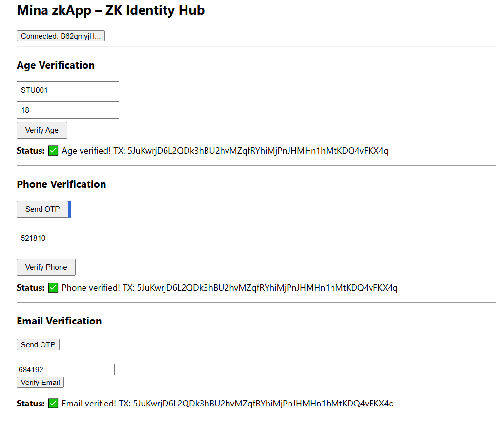

# Mina zkApp – ZK Identity Hub

A Zero-Knowledge-based Identity Verification Hub built on **Mina Protocol** that enables privacy-preserving verification of:

- ✅ Age  
- ✅ Phone Number  
- ✅ Email Address  

This project demonstrates how Zero-Knowledge Proofs (ZKPs) can verify user attributes **without revealing sensitive personal data on-chain**.

---

## 🚀 Vision

Traditional identity systems store and expose personal information.

This zkApp shows how we can:

- Verify identity attributes using ZK proofs
- Store only verification status on-chain
- Preserve user privacy
- Enable compliant Web3 onboarding

The long-term goal is to build a **Decentralized ZK Identity Infrastructure on Mina**.

---

## 🧠 Why Mina Protocol?

Mina enables:

- Lightweight zkApps
- Constant-size blockchain
- Efficient proof verification
- Recursive proof composition

This makes Mina ideal for scalable privacy-preserving identity systems.

---

## 🏗️ Architecture

Frontend (Wallet Connected UI)  
⬇  
Zero-Knowledge Proof Generation  
⬇  
Mina zkApp Smart Contract  
⬇  
On-chain Verification State Update  

---


## 🔐 Core Features

- Age verification via zkApp proof
- Phone verification (OTP simulation)
- Email verification (OTP simulation)
- On-chain verification flags
- Privacy-preserving identity state

---

## 📸 UI Preview


## 🛠️ Tech Stack

- Mina Protocol (Devnet)
- o1js 
- TypeScript
- HTML / JavaScript
- Auro Wallet
- Zero-Knowledge Proofs

---

## 📂 Project Structure

```
zk-identity-hub/
│
├── src/                # zkApp smart contract
├── scripts/            # deployment scripts
├── backend/            # backend (OTP / verification logic)
├── frontend/           # UI
├── package.json
├── tsconfig.json
└── README.md
```

---

## ⚙️ Setup Instructions

### 1️⃣ Install Dependencies

```bash
npm install
```

### 2️⃣ Build zkApp

```bash
npm run build
```

### 3️⃣ Deploy to Mina Devnet

```bash
npm run deploy
```

### 4️⃣ Run Frontend

Navigate to the frontend directory:

```bash
cd frontend
npm install
npm start
```
Connect Auro Wallet and interact with the deployed zkApps.

---

## 🌐 Deployment Details

Network: Mina Devnet  

### Deployed Contract Addresses:
- AgeVerifierDevnet: B62qor9EwMMyfEG7zciYCahgxjQ4NQ96aETEXZHzWZYw1vu4dEetabk
- PhoneVerifierDevnet: B62qoTCuspbMGa2uP3ZL6P8rHLsPdiwDaV4UaUMsvuSRABBr5HtRWyS
- EmailVerifierDevnet: B62qpZLZyLXXzz9gBtCuoHAw23G8ELHMKnd9HkWpGGPNCFLjBhJXn9G

### Example Deployment Transaction:
https://minascan.io/devnet/tx/5JuKwrjD6L2QDk3hBU2hvMZqfRYhiMjPnJHMHn1hMtKDQ4vFKX4q


## 🔎 Smart Contract Modules

This project contains three zkApp smart contracts:

### 1️⃣ AgeVerifierDevnet.ts
Verifies age condition and updates on-chain state

### 2️⃣ PhoneVerifierDevnet.ts
Handles phone verification logic

### 3️⃣ EmailVerifierDevnet.ts
Handles email verification logic

Each module maintains its own verification state on Mina Devnet.


---

## 🔐 Privacy Model

- No raw personal data is stored on-chain
- Only verification states are recorded
- Verification logic executed via Zero-Knowledge proofs
- Designed for selective disclosure and privacy preservation


---

## 🌍 Potential Use Cases

- University digital identity
- zk-KYC infrastructure
- Age-restricted dApps
- Web3 login systems
- Privacy-preserving compliance systems

---

## 🧩 Modular zkApp Design

Instead of combining all logic into one contract,
this project demonstrates a modular architecture
where each identity attribute is verified via an independent zkApp.

This enables:

- Scalability
- Upgradability
- Separation of concerns
- Independent proof verification

---

## 🔮 Future Improvements

- Production-grade ZK circuits
- Secure off-chain verification integration
- Mainnet deployment

---

## 👨‍💻 Authors

Dr. Shouvik Dey  
Dr. Rumpa Dey  

Blockchain | Zero-Knowledge | Privacy Systems

---

## 📜 License

MIT License
